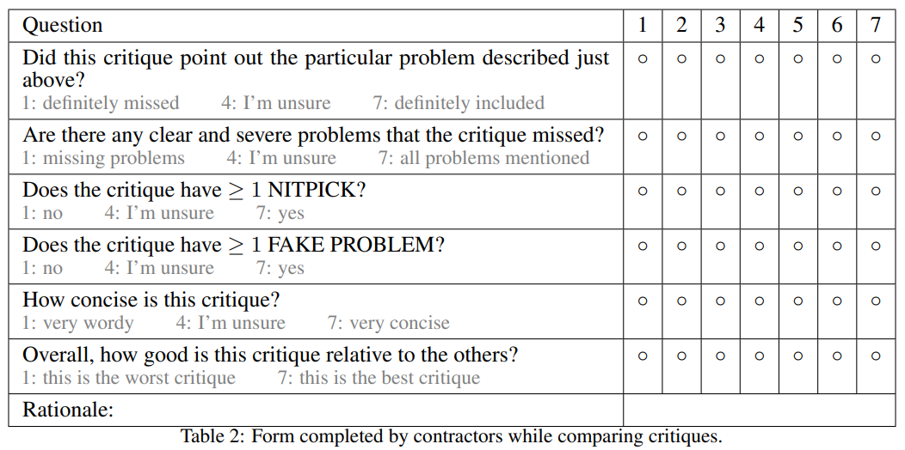

# Humaneval Benchmark

> Conda Environment

- Run the following commands.
```
!conda create --name debugger_llm_humaneval python=3.10
!conda activate debugger_llm_humaneval
!conda install datasets pandas python-dotenv tqdm datasets huggingface_hub
!pip install litellm
```
- Additionally, when pushing datasets to HuggingFace, make sure to install `git-lfs` for your OS.

> Human Annotated Evaluation

- Evaluting bug analysis from LLM Judges follows the same grading criteria as the [OpenAI's paper](https://arxiv.org/abs/2407.00215).


> HuggingFace

- The completed dataset is uploaded at [https://huggingface.co/datasets/techandy42/debugger_llm_humaneval_dataset_v1](https://huggingface.co/datasets/techandy42/debugger_llm_humaneval_dataset_v1).

> Documentation

- The data processing consists of several steps.
- To modify the dataset/filepath that you want to work with for each Python script, simply adjust the constant (e.g. uppercase variables) strings located at the top of each file.
- Note, from the first script to last script listed below, the main data is stored in the same file (e.g. `humaneval_test_dataset.py`). All of the other files/folders are for human data annotation.
- **Important!**: make sure to complete each step before running the subsequent script.

1. `pipeline.py`
- Run this file first to generate code solutions to each problem in the HumanEval dataset.
- Note, to generate N solutions for the dataset, adjust the `ITER_NO` variable from `1..N` (e.g. run N separate times).

2. `judge.py`
- After running `pipeline.py`, run this file to generate LLM Judge's analysis of any buggy code sample (e.g. code solutions) that fail the unit tests associated with each problem.

3. `generate_guides.py` (Manual Work Involved)
- Generates a folder of files for creating custom bug analysis (e.g. basically same as `judge.py`, but done manually to create high-quality data as ground truth).
- Modify `*_custom.txt` to fill in your answers, take a look at `*_guide.txt` to reference LLM solutions for the same problem.

4. `extract_human_analysis.py`
- Extracts your custom bug analyses from step 3 and stores them in the CSV file (e.g. `humaneval_test_dataset.py`).

5. `generate_annotations.py` (Manual Work Involved)
- Generates a folder of files for scoring each LLM/Custom bug analyses for the buggy code samples.
- For each `*_analysis_1.txt`, `*_analysis_2.txt`, ... files, fill in a number for each blank spot (e.g. `- S1: _/7`) between 1-7 depending on how good the bug analysis is for each category. Refer to table from OpenAI's paper above for the marking process.

6. `extract_annotations.py`
- Extracts your scoring for each problem and stores them in the CSV file (e.g. `humaneval_test_dataset.py`).

7. `format_dataset.py`
- Takes a CSV file (e.g. `humaneval_test_dataset.py`) and extracts only the relevant columns and rows and stores them in another CSV file (e.g. `humaneval_test_dataset_v1.py`).

8. `upload_to_hf.py`
- Uploads the train/test datasets (e.g. stored as CSV files locally, such as `humaneval_train_dataset_v1.py` and `humaneval_test_dataset_v1.py`) into a HuggingFace dataset repo.
